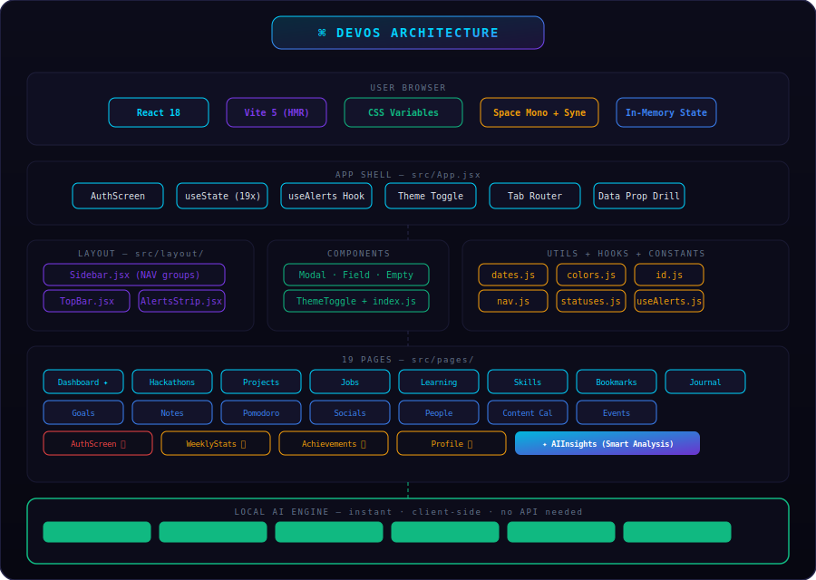

# ⌘ LifeOS | Personal Operating System

<div align="center">


**One home for your work, health, goals, and life.**

[🚀 Live Demo](https://codenimra.github.io/devos/)

</div>

---

## What is LifeOS?

LifeOS is a personal operating system a complete life management platform built for every kind of person. Not just developers. Not just students. Anyone who has a life to manage.

A software engineer tracks projects and job applications. A medical student logs study sessions and clinical skills. A parent stores emergency contacts and family events. A freelancer manages clients and content. A homemaker organizes habits and household goals. One app. Every field. Every life.

LifeOS runs entirely in the browser, works offline, installs like a native app, and requires no account or password — just your name, and your OS is ready.

---

## Features

### ⌘ Home
A personalized dashboard that greets you by name and time of day, shows a daily motivation quote rotating every 24 hours, surfaces your priority queue, today's habit progress, active goals, and upcoming events at a glance.

### 💼 Work
| Module | Description |
|---|---|
| **Competitions** | Track hackathons, challenges, and grants with color-coded deadline urgency |
| **Opportunities** | Full pipeline: wishlist → applied → interviewing → offer |
| **Projects** | Link projects to competitions, track status, GitHub and demo links |
| **Learning** | Schedule sessions with deadlines, categories, and resources |
| **Skills** | Visual proficiency map across 20 universal categories — tech, medical, creative, business, and more |

### 🔨 Build
| Module | Description |
|---|---|
| **Goals** | Goal tracking with sub-tasks, progress bars, categories, and deadlines |
| **Habits** | Daily habit tracker with 7-day streak dots and 🔥 streak counter |
| **Exercise** | Log workouts, set wake/sleep/exercise times, track weekly stats |
| **Books** | Reading list with progress bars, star ratings, key takeaways, and yearly count |
| **Hobbies** | Schedule hobby time with weekly hour goals and session logging |
| **Notes** | Color-coded pinnable notes |
| **Focus** | Built-in Pomodoro focus timer |

### 🔗 Connect
| Module | Description |
|---|---|
| **People** | Contact manager for mentors, colleagues, recruiters, doctors, friends |
| **Calls** | Log every important call with summary, follow-up action, and due date |
| **Events** | Track conferences, appointments, meetups, and family events |
| **Content** | Plan blog posts, videos, and social content with scheduled dates |
| **Socials** | All profiles in one place with follower tracking |

### 👤 You
| Module | Description |
|---|---|
| **AI Coach** | Instant smart analysis — priority queue, productivity score, mood trend, suggestions |
| **Journal** | Daily entries with 1–5 mood tracking and tags |
| **Medical** | Emergency contacts, blood type, medications, allergies, and health conditions |
| **Weekly Review** | Progress summary across all sections |
| **Wins** | Achievement tracker that unlocks based on real activity |
| **Profile** | Your info, field, and personal overview |

---

## ✦ AI Coach

The AI Coach analyzes your real data and returns actionable insight instantly, with no API key and no internet required.

```
Open AI Coach
      ↓
Local engine reads: deadlines · mood entries · habit streaks
                    goal progress · skill gaps · job pipeline
      ↓
Returns in under 1 second:
  • Productivity score (0–100)
  • Priority queue — color-coded by urgency
  • Smart suggestions — based on your actual patterns
  • Mood trend chart — from journal entries
  • Progress breakdown — learning, goals, habits
  • Skill distribution — by category
```

---

## 🏗 Architecture



### Project structure

```
lifeos/
├── index.html                    # PWA entry — registers service worker
├── package.json
├── vite.config.js
├── public/
│   ├── manifest.json             # PWA manifest — install as app
│   └── sw.js                     # Service worker — offline caching
└── src/
    ├── main.jsx
    ├── App.jsx                   # Root — state, routing, all 25 modules
    ├── styles/
    │   └── globals.css
    ├── constants/
    │   ├── nav.js                # 5 groups, 25 sidebar items
    │   ├── statuses.js           # Universal skill categories + all status maps
    │   └── platforms.js
    ├── utils/
    │   ├── id.js
    │   ├── dates.js
    │   └── colors.js
    ├── hooks/
    │   └── useAlerts.js
    ├── components/
    │   ├── Modal.jsx
    │   ├── Field.jsx
    │   ├── Empty.jsx
    │   ├── ThemeToggle.jsx
    │   └── index.js
    ├── layout/
    │   ├── Sidebar.jsx
    │   ├── TopBar.jsx
    │   └── AlertsStrip.jsx
    └── pages/
        ├── AuthScreen.jsx        # Splash screen — name + field only
        ├── Dashboard.jsx         # ⌘  Daily quote · priority queue · habit progress
        ├── Hackathons.jsx        # 🏆  Competitions
        ├── Jobs.jsx              # 💼  Opportunities
        ├── Projects.jsx          # 🚀  Projects
        ├── Learning.jsx          # 📚  Learning
        ├── Skills.jsx            # 🧩  Skills — 20 universal categories
        ├── Goals.jsx             # 🎯  Goals
        ├── Habits.jsx            # ✅  Habits + streak tracker
        ├── Exercise.jsx          # 💪  Exercise + daily schedule
        ├── Books.jsx             # 📖  Books + reading progress
        ├── Hobbies.jsx           # 🎨  Hobbies + session logging
        ├── Notes.jsx             # 📋  Notes
        ├── Pomodoro.jsx          # ⏱   Focus timer
        ├── People.jsx            # 🤝  People
        ├── Calls.jsx             # 📞  Call log + follow-ups
        ├── Events.jsx            # 🗓  Events
        ├── ContentCalendar.jsx   # 📣  Content
        ├── Socials.jsx           # 🌐  Socials
        ├── AIInsights.jsx        # ✦   AI Coach — local smart analysis
        ├── Journal.jsx           # 📓  Journal + mood tracking
        ├── Medical.jsx           # 🏥  Emergency contacts · medications · allergies
        ├── WeeklyStats.jsx       # 📊  Weekly review
        ├── Achievements.jsx      # 🏅  Wins
        └── Profile.jsx           # 👤  Profile
```

---

## ⚡ Quick Start

### Requirements
- Node.js 18+
- npm

### Run locally

```bash
git clone https://github.com/codeNimra/devos.git
cd devos
npm install
npm run dev
```

Open `http://localhost:5173`, enter your name, and your OS is ready.

### Try the live demo

[codenimra.github.io/devos](https://codenimra.github.io/devos/)  no login, no setup.

---

## Deploy

```bash
npm run deploy
```

Builds and pushes `dist/` to the `gh-pages` branch. Live in approximately two minutes at `https://<codenimra>.github.io/devos`.

---

## Offline / PWA

LifeOS is a fully installable Progressive Web App. On first load, the service worker caches all assets. On every visit after with or without an internet connection LifeOS loads instantly. On any device, install it to the home screen and use it like a native app.

---

## Design System

| Token | Dark mode | Light mode |
|---|---|---|
| Background | `#05050f` | `#f0f4f8` |
| Surface | `#0a0a1a` | `#ffffff` |
| Cyan accent | `#00d4ff` | `#00d4ff` |
| Purple accent | `#7c3aed` | `#7c3aed` |
| Text primary | `#f1f5f9` | `#0f172a` |
| Fonts | Space Mono + Syne | Space Mono + Syne |

Themes switch via `data-theme` on `<html>` — instant, no flash.

---

## Tech Stack

| Layer | Technology |
|---|---|
| UI | React 18 |
| Build | Vite 5 |
| Styling | Pure CSS + CSS Variables |
| AI Analysis | Smart client-side engine — local, instant, private |
| PWA | Service Worker + Web Manifest |
| Fonts | Google Fonts — Space Mono + Syne |
| State | React useState |
| Deploy | GitHub Pages |

---

## Built For

**Frostbyte Hackathon Grand Finale 2026**
Themes: Business Management Tools · AI/ML · Software Development · Healthcare & BioTech

---

## License

MIT free to use, fork, and build on.

---

<div align="center">
  Made by <a href="https://github.com/codeNimra">Nimra Abid</a>
  <br/>
  <sub>React 18 · Vite 5 · Pure CSS · PWA · GitHub Pages</sub>
</div>